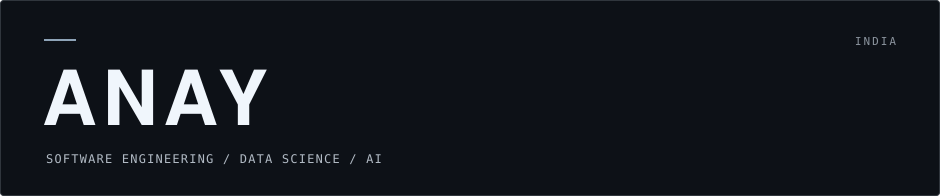

<!-- Replace the YOUR_* placeholders before publishing. -->

<h1 align="center">
  
</h1>

  <strong>B.Tech CSE (Data Science)</strong> 
  AI Engineering · Machine Learning · Data Science · Full-Stack Development

  <picture>
    <source media="(prefers-color-scheme: dark)" srcset="https://readme-typing-svg.demolab.com?font=Fira+Code&amp;weight=400&amp;size=18&amp;duration=4200&amp;pause=1800&amp;color=8EA4B8&amp;center=true&amp;vCenter=true&amp;width=620&amp;height=48&amp;lines=Machine+Learning+%26+AI+Engineering;Full-Stack+Developer;Building+Intelligent+Software+Systems" />
    
  </picture>

  Based in India 
  <a href="#selected-projects">Selected projects</a> ·
  <a href="#technical-focus">Technical focus</a> ·
  <a href="#connect">Connect</a>

---

## About Me

I'm Anay, a B.Tech student in Computer Science Engineering (Data Science). I'm building a strong foundation across software engineering, data science, machine learning, and AI. I want to understand both how intelligent systems are built and how software and data can solve problems outside a notebook or classroom.

I learn through implementation. Building practical projects gives me a way to experiment with new technologies, work through technical problems, and understand what happens beneath an API or framework. I enjoy tracing how the pieces fit together: where the data comes from, how a system makes decisions, and how those decisions reach a usable interface.

My current direction brings machine learning, deep learning, and AI engineering together with backend and full-stack development. Alongside that work, I'm strengthening my understanding of data structures and algorithms, database systems, and cloud computing. I want the software around a model to receive the same care as the model itself.

## What I Work With

<!-- Monochrome Shields badges use Simple Icons where a suitable icon is available. -->

| Area | Technologies & foundations |
| :--- | :--- |
| **Languages** |      |
| **Frontend** |  |
| **Backend** |   |
| **Databases** |    |
| **Data Science & ML** |     |
| **Computer Science** | Data Structures & Algorithms (DSA) · Database Management Systems (DBMS) |
| **Cloud & Developer Tools** |    |

## Technical Focus

I'm working toward understanding the full path from raw data to a deployed application, while continuing to strengthen the fundamentals underneath it.

| Focus | What I'm developing |
| :--- | :--- |
| **01 / Data foundations** | Preprocessing, exploratory analysis, visualization, and statistics; learning to turn raw data into dependable inputs for machine learning pipelines. |
| **02 / Machine learning** | Supervised and unsupervised learning, feature engineering, model evaluation, and deep learning; understanding what an experiment actually demonstrates. |
| **03 / AI engineering** | Model inference, APIs, and application integration; learning the workflows that turn a model into usable software. |
| **04 / Software engineering** | Backend architecture, API design, database modeling, and full-stack development; reasoning about how components interact as a system. |
| **05 / Cloud** | Learning how to deploy and operate applications and AI systems on AWS, with attention to configuration, reliability, and resource usage. |
| **Ongoing / Computer science** | Data structures, algorithms, DBMS concepts, and systematic problem solving; building the foundation for better implementation decisions. |

---

## Selected Projects

<!-- Project stacks were not supplied. Replace each technology placeholder with the actual stack. -->

### Stride

An AI-powered fitness mobile application.

**Technologies:** `YOUR_STRIDE_TECH_STACK`  
[Repository](YOUR_STRIDE_REPOSITORY_LINK)

### Noodle

A full-stack AI fitness platform.

**Technologies:** `YOUR_NOODLE_TECH_STACK`  
[Repository](YOUR_NOODLE_REPOSITORY_LINK)

### Automated Question Paper Generator

An AI-powered question paper generation system based on Bloom's Taxonomy.

**Technologies:** `YOUR_QUESTION_PAPER_TECH_STACK`  
[Repository](YOUR_QUESTION_PAPER_REPOSITORY_LINK)

### Orb Arena

A game project focused on building a more complex interactive software project.

**Technologies:** `YOUR_ORB_ARENA_TECH_STACK`  
[Repository](YOUR_ORB_ARENA_REPOSITORY_LINK)

---

## GitHub Activity

<!-- These SVGs appear after the profile-visuals workflow completes successfully. -->

  
  

  Public activity and repository language usage. Language share reflects code volume, not proficiency.

## Contribution Activity

  <picture>
    <source media="(prefers-color-scheme: dark)" srcset="https://raw.githubusercontent.com/YOUR_GITHUB_USERNAME/YOUR_GITHUB_USERNAME/output/github-snake-dark.svg" />
    <source media="(prefers-color-scheme: light)" srcset="https://raw.githubusercontent.com/YOUR_GITHUB_USERNAME/YOUR_GITHUB_USERNAME/output/github-snake.svg" />
    
  </picture>

---

## Connect

For conversations about software, data, AI, or the projects above.

[GitHub](https://github.com/YOUR_GITHUB_USERNAME) · [LinkedIn](YOUR_LINKEDIN_URL) · [Email](mailto:YOUR_EMAIL_ADDRESS)
